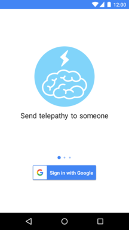
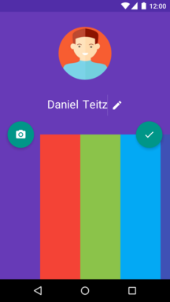
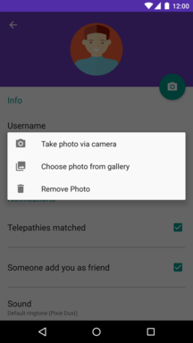
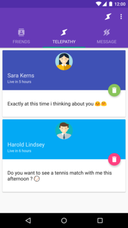
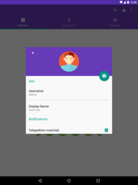
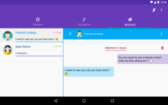

## Telepathy Android App

### project dependencies

1. Run the [telepathy backend project](https://github.com/atahani/telepathy-backend)

2. if you don't have GCM information such as `google-service.json` file, create project inside [Google Developer Console](https://console.developers.google.com),
then follow this [link](https://developers.google.com/mobile/add?platform=android&cntapi=gcm) , select project name like **Demo App** and android package name **com.atahani.telepathy**
and enable Google Sign-in, Cloud Messaging and and App Invites,
 for GCM service store `Server API Key` and `Sender ID` values for backend project,
 finally click on generate configuration `google-services.json` file.
 
3. for google sign in create another the API key for server. 

4. `optional step` we use from slack to report application errors, so you can create a [bot user](https://api.slack.com/bot-users) and got the `Access Token`

### how to user from this project

##### clone the repository

```
git clone https://github.com/atahani/telepathy-android.git
cd telepathy-android
```

##### set Client Configs variables

replace the `REST_END_POINT_URL`, `TELEPATHY_APP_ID`, `TELEPATHY_APP_KEY`, `GOOGLE_SERVER_CLIENT_ID` and `SLACK_BOT_TOKEN` values inside `ClientConfigs` class

NOTE: gradle have two flavor `debug` and `release`, so we have `ClientConfigs.java` class in two path `src/debug/.../network/ClientConfigs.java` and `src/release/.../network/ClientConfigs.java`

##### copy the google play service config file

copy the `google-services.json` file in this path `app/`

NOTE: since the package name change in different build `debug` or `release`, you should replace related `google-services.json` file in `app/` path.

##### select build variants and run the application

in android studio select the build variants `debug` or `release` and run the app
  

#### Screenshots

 &nbsp;  &nbsp; 

 &nbsp; 





#### More Information
 
for more information about telepathy project see the related posts inside [my blog] (http://atahani.com/tags/telepathy/)